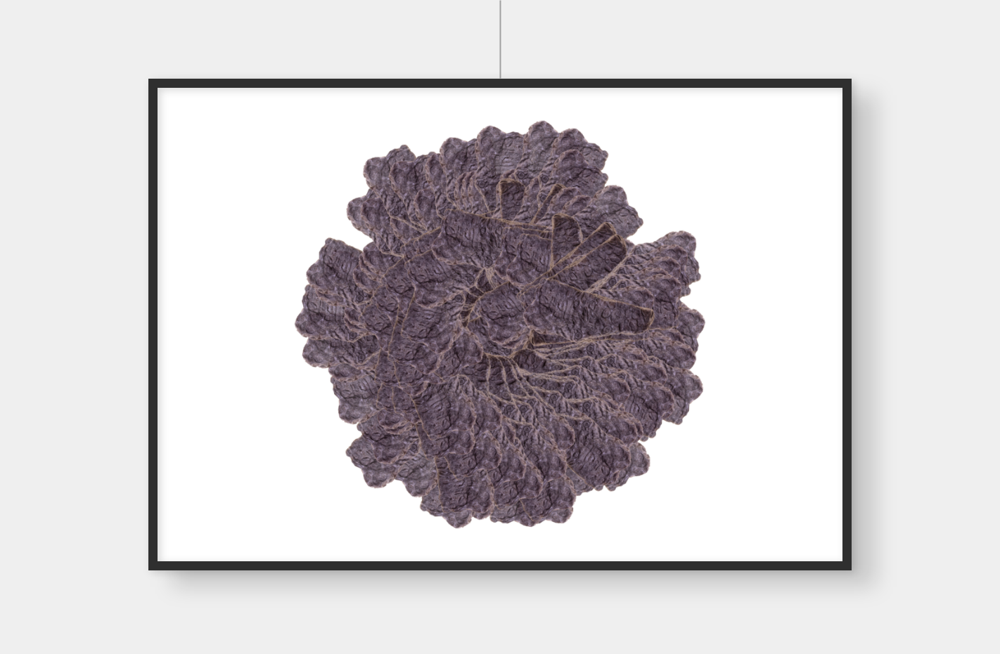
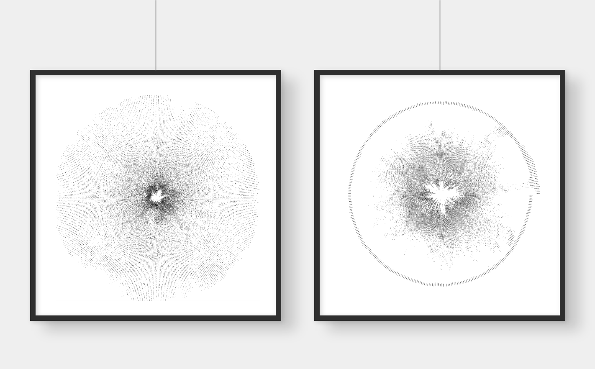

# sammlung-fotogalerie-im-rathaus

# Matthias Jäger

Matthias Jäger (* 1979, AT) lebt und arbeitet in Graz. Er schafft ästhetische Kompositionen aus einfachen Regeln, die er im Vorfeld definiert und dann zur Anwendung bringt. Er spricht davon ein Werk zu entwickeln, denn er arbeitet diese Regeln in geschrieben Code um. Mit Algorithmen bearbeitet er beispielsweise Daten einer Fotographie und konstruiert daraus neue Serien von Bildern. Die Inspiration für seine Arbeit findet gleichermaßen im Bewegen durch Natur und Landschaft und seiner Faszination für die hoch-technische Umwelt in der wir leben.

## grapholith-rotation

Das Eingangsbild 'grapholith', von Heinz Pöschko, zeigt einen dunklen Stein mit einer interessanten Struktur. Das Programm erschafft durch eine pseudo-zufalls-gesteuerte Bewegung entlang eines Kreises eine neue Struktur aus individuell gedrehten Kopien des Eingangsbilds.

*Hängevorschlag, 100x70*

## grid-scapes

Ausgangspunkt der Serie 'grid-scapes' sind Landschaften im steirischen Bergland. Die weitere Bearbeitung ist als Dunkelkammer zu verstehen in der entwickelt wird. Ein Raster wird über das Bild gelegt und in jeder Zelle misst der Algorithmus die Farbe im Mittelpunkt. Die Werte für Rot, Grün und Blau werden mit einer Linie visualisiert. Länge, Strichstärke und Drehung der Linie abhängig sind von den Farben. Endprodukt ist eine abstrakte Liniengrafik die Visualisierung der Daten und gleichermaßen selbst das Bild ist.

*Hängevorschlag: Großofen, Hochreichart, 50x70*

## reflections

Die beiden Aufnahmen von Spiegelungen in den kleinen Teichen des Grazer Eustacchio-Parks wurden mit dem Programm 'small-areas-of-symmetry' bearbeitet. Das Programm sucht zufällig Teilstücke aus einem gegebenen Referenzbild und manipuliert die Farben eines jeden Teilstücks so, das symmetrisch gespiegelte Muster entstehen. Danach vermischt es diese Bereiche wieder mit dem Origial und es entsteht ein neues Bild das für mich zwischen natürlicher und künstlicher Welt zu schweben scheint.

*Hängevorschlag: Kleiner Teich, Moosig, 50x70*

## stripes

Die Serie 'stripes' untersucht die Farben eines Eingangsbildes. Es werden in der linken und rechten Bildhälfte alle Farben entlang der vertikalen Bildache gemessen. Aus diesem Paar aus zwei Farben pro Bildzeile bildet sich eine Grafik mit einem exakt interpoliertem Verlauf von linker zu rechter Farbe entlang der horizontalen Bildachse. Die Fotographie verliert durch diesen Prozess jegliches Detail und löst sich in eine Kompositon aus Streifen auf. Die generelle Farbwirkung der Fotos bleibt aber trotz der starken Abstraktion auf seltsame Weise erhalten.

*Hängevorschlag: Das alte Haus, Fliederbush am Fenster, 60x60*

## polar-brightness-map

Das Programm erstellt eine Liste mit allen Helligkeits-Werten eines Eingabebildes. Von links oben nach rechts unten füllt sich diese Liste ja nach Beschaffenheit des Bildes mit unterschiedlichen Zahlen zwischen 0 (Schwarz) und 1 (Weiß). Danach werden diese Zahlen als Skalierungs-Wert für den Radius in einer kreisenden Bewegung angewandt.

*Hängevorschlag: Gösseck, Rupertisteig, 60x60*