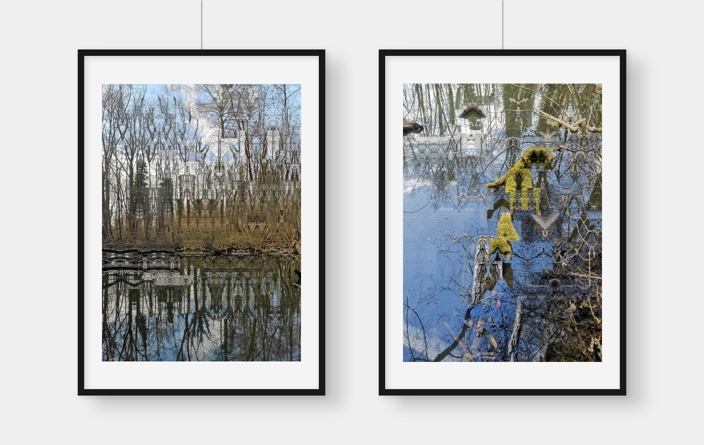

# sammlung-fotogalerie-im-rathaus

## grapholith

## gridscapes

## reflections

### Ideas

- [ ] painterly
- [ ] Take example from genuary?
- [ ] Versionize the cDistShape sketch
- [ ] Use an analogue medium format black and white image for reflections?
- [ ] Flowfield & colormap
- [ ] Use a mirror?