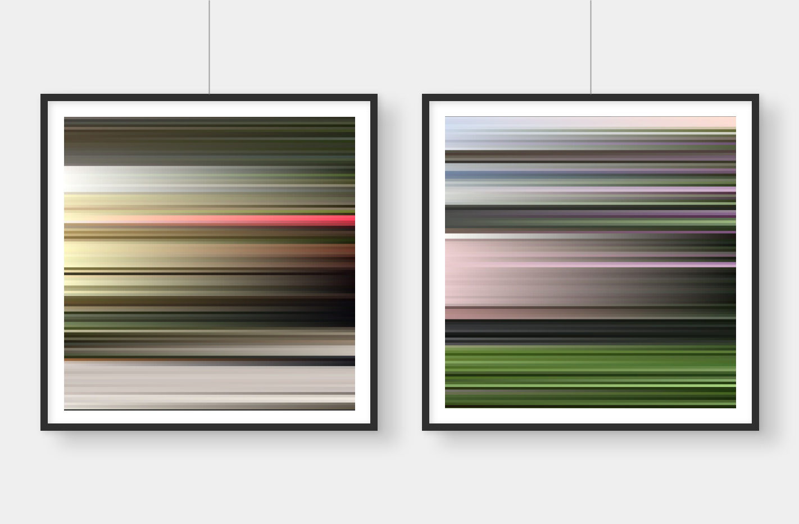

# sammlung-fotogalerie-im-rathaus

## grapholith

> Die 'Rotation des Grapholith' entnimmt Farben aus der Fotographie 'grapholith' von Heinz Pöschko. Sie erschafft durch eine pseudo-zufalls-gesteuerte Bewegung entlang eines Kreises in der Blatt-Mitte eine neue Struktur aus individuell gedrehten und rotierten Kopien des Eingangsbilds.

## gridscapes

> Ausgangspunkt der Serie 'grid-scapes' sind Landschaften im steirischen Bergland. Die weitere Bearbeitung ist als Dunkelkammer zu verstehen in der entwickelt wird. Ein Raster wird über das Bild gelegt. In jeder Zelle misst der Algorithmus die Farbe im Mittelpunkt. Die Werte für Rot, Grün und Blau werden mit einer Linie visualisiert. Länge, Strichstärke und Drehung der Linie abhängig sind von den Farben. Endprodukt ist eine abstrakte Liniengrafik die Visualisierung der Daten und gleichermaßen selbst das Bild ist.

## reflections

## stripes

## pixeldata

